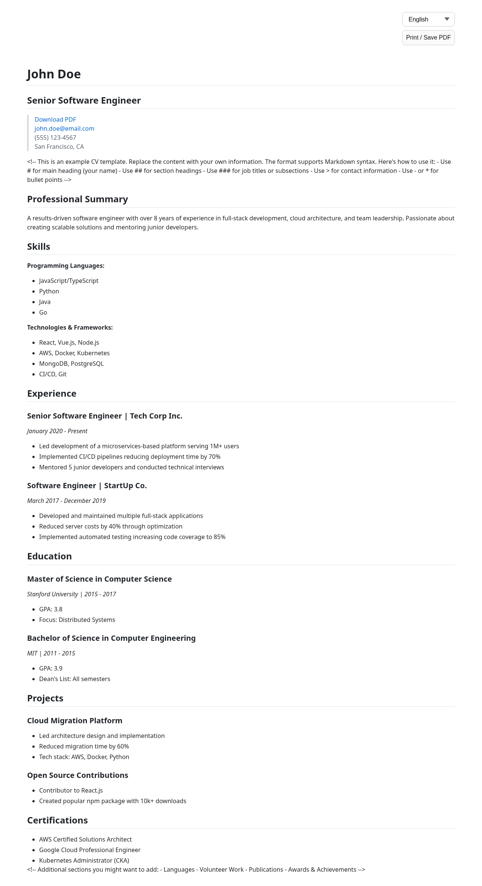
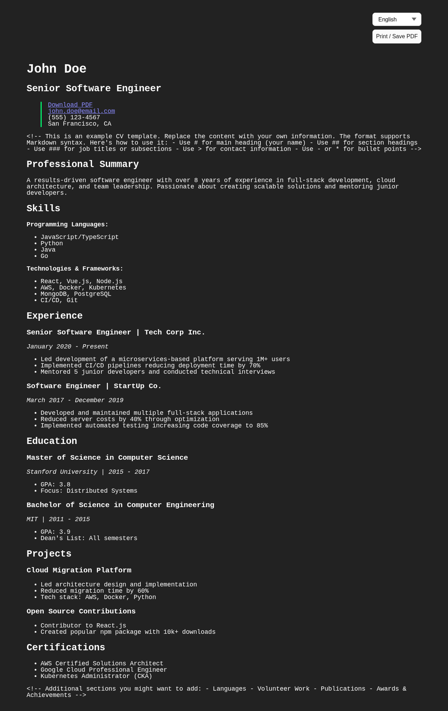
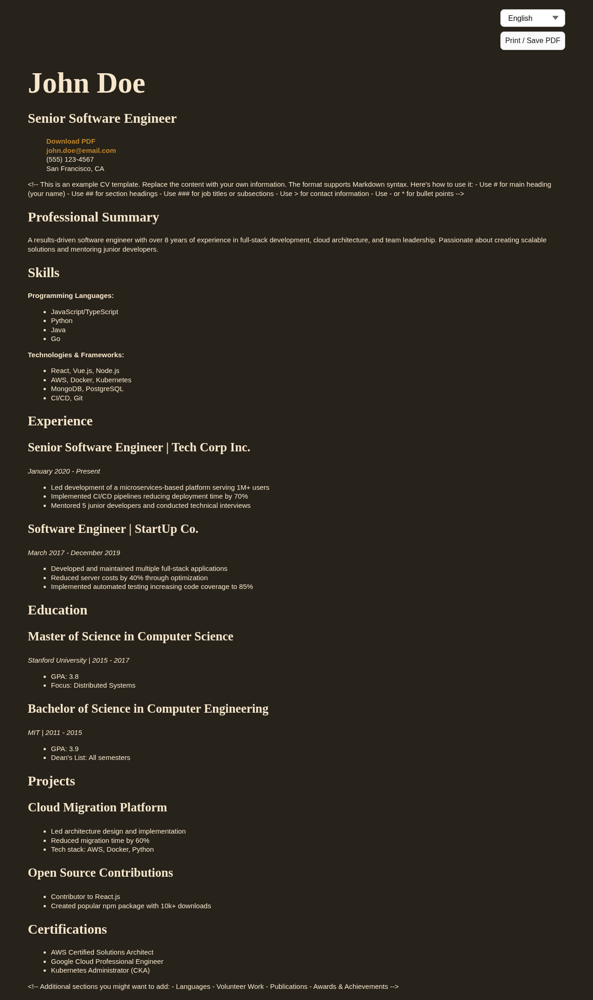

# Markdown CV Builder

A modern, customizable CV/Resume builder that converts Markdown to a beautiful web page and PDF. Perfect for developers and tech professionals who want to maintain and host their CV on gh-pages.

**🔗 [View Live Demo](https://prbart.github.io/markdown-cv-builder/)**

## 🚀 Features

- Write your CV in Markdown with YAML frontmatter for configuration
- Multiple language support
- Multiple theme options
- Automatic deployment to GitHub Pages
- PDF export
- Mobile-responsive design
- SEO-friendly meta tags, favicon, and social preview image per language

## 🛠️ Quick Start

### Use this template

1. Click **Use this template** on GitHub and create a new repository.
2. Enable GitHub Pages:
   - Go to repository **Settings → Pages**
   - Set **Source** to **GitHub Actions**
3. Edit your CV in `markdown-source/` (start with `cv.default.en.md`).
4. Push to `master` — the site deploys automatically.

> **Maintainers:** enable **Template repository** in **Settings → General** so the **Use this template** button appears for everyone.

Alternatively, fork the repository and follow the same Pages setup.

Your site will be available at `https://[your-username].github.io/[repository-name]`.

### Local development

```bash
npm install
npm run dev
```

Validate and build:

```bash
npm run validate
npm run build
```

## 📝 Markdown Format

Each CV file starts with YAML frontmatter, followed by Markdown content:

```markdown
---
$schema: ../config/cv.frontmatter.schema.json
lang: en
label: English
default: true
title: John Doe — CV
description: Senior Software Engineer with 8+ years of experience.
printLabel: Print / Save PDF
theme: github
favicon: favicon.svg
ogImage: assets/og-preview.svg
siteUrl: https://your-username.github.io/your-repository
---

# John Doe
## Senior Software Engineer

> [john.doe@email.com](mailto:john.doe@email.com)
```

The `$schema` field enables IDE autocomplete via [`config/cv.frontmatter.schema.json`](config/cv.frontmatter.schema.json). Regenerate it after schema changes:

```bash
npm run schema:generate
```

### Frontmatter fields

| Field | Required | Description |
|-------|----------|-------------|
| `$schema` | no | JSON Schema path for IDE validation (e.g. `../config/cv.frontmatter.schema.json`) |
| `lang` | yes* | Language code (e.g. `en`, `de`, `ru`) |
| `label` | no | Display name in the language switcher |
| `default` | no | Set to `true` for the default language |
| `title` | no | Browser tab title and social preview title |
| `description` | no | Meta description for SEO and social previews |
| `printLabel` | no | Text for the print/PDF button |
| `theme` | no | Theme preset: `github`, `retro`, or `screen` (default language only) |
| `favicon` | no | Path to favicon in `public/` (e.g. `favicon.svg`) |
| `ogImage` | no | Path to social preview image in `public/` (e.g. `assets/og-preview.png`) |
| `siteUrl` | no | Public site URL for absolute `og:image` and `og:url` (default language only) |

\*If omitted, `lang` is inferred from the filename (`cv.en.md` → `en`, `cv.default.en.md` → `en` + default).

`favicon`, `ogImage`, and `siteUrl` can be set on the default language file and reused by other languages.

### Markdown content

The CV body supports standard Markdown syntax:
- Use `#` for your name
- Use `##` for main sections
- Use `###` for subsections or job titles
- Use `>` for contact information
- Use `-` or `*` for bullet points

See `markdown-source/cv.default.en.md` for a complete example.

## 🎨 Themes

| github | retro | screen |
|--------|-------|--------|
|  |  |  |

Available presets:
- `github` — Clean, professional GitHub-style theme (default)
- `retro` — Classic paper-like theme
- `screen` — Modern, screen-optimized theme

Set the theme in the frontmatter of your default language file:

```yaml
theme: retro
```

## 🌐 Custom domain

1. In **Settings → Pages**, enter your custom domain (e.g. `www.example.com`).
2. Configure DNS:
   - **CNAME** record: `www` → `<username>.github.io`, or
   - **A/AAAA** records pointing to [GitHub Pages IPs](https://docs.github.com/en/pages/configuring-a-custom-domain-for-your-github-pages-site/managing-a-custom-domain-for-your-github-pages-site#configuring-an-apex-domain)
3. Set `siteUrl` in the default language frontmatter so social previews use absolute URLs:

```yaml
siteUrl: https://www.example.com
```

4. Optionally add `public/CNAME` containing your domain — GitHub Pages will include it in the deployment.

## ✅ Validation & Tests

```bash
npm run validate      # frontmatter + assets
npm run test          # unit, integration, UI, and build smoke tests
npm run test:coverage # same tests + coverage report (optional)
npm run check         # validate + typecheck + lint + test
npm run build         # check + production build
```

Coverage report is generated locally at `node_modules/.tmp/coverage/` (open `index.html` in a browser). This folder is temporary and is not committed to git.

GitHub Actions runs `npm run build` on every push and pull request.

The test suite lives in `tests/` and covers:
- `tests/unit/` — parsing, schema, validation, meta tags
- `tests/integration/` — all committed files in `markdown-source/` and `public/`
- `tests/ui/` — React pages, routing, and language switching
- `tests/smoke/` — production Vite build

`npm run validate` checks frontmatter before every build:

- required fields and allowed values
- exactly one default language
- no duplicate `lang` codes
- `favicon` and `ogImage` paths exist in `public/`
- `theme` and `siteUrl` are only set on the default language file

## 🔄 Automatic Deployment

The CV automatically deploys to GitHub Pages when you:
1. Push changes to the `master` branch
2. The GitHub Action validates, builds, and deploys your CV via GitHub Pages artifacts
3. View your CV at `https://[your-username].github.io/[the-name-of-your-repository]`

You can also trigger a manual deploy from **Actions → Manual Deploy to GitHub Pages**.

## 📱 Mobile Responsive

Your CV will look great on all devices — desktop, tablet, and mobile.

## 📄 License

This project is licensed under the MIT License — see the [LICENSE](LICENSE) file for details.
